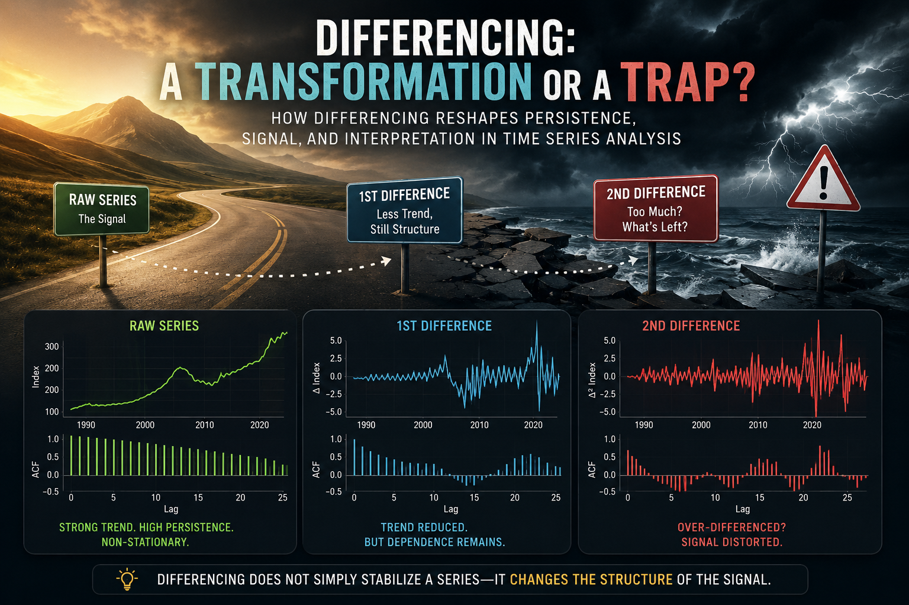

{fig-align="center"}

# Introduction

Differencing is one of the most common transformations in time series analysis.

It is also one of the easiest transformations to misunderstand.

In many ARIMA-style workflows, differencing is introduced almost mechanically: if a series is not stationary, take a difference; if it still appears non-stationary, take another one. While this advice is not entirely wrong, it can quietly create a dangerous habit. Differencing is not merely a technical preprocessing step — it changes the object of analysis itself.

In the previous article of this series, *Why Most Time Series Models Fail Before They Start*, we explored stationarity using real CPI data and discussed why many forecasting problems begin long before model estimation. The central idea was simple but important: unstable statistical properties can make even sophisticated models misleading.

You can read the first article here:

<https://mfatihtuzen.github.io/posts/2026-04-16_timeseries_stationary/>

This article continues that discussion with a more subtle question:

> What exactly happens when we difference a time series?

To explore this question, we will use the **S&P CoreLogic Case-Shiller U.S. National Home Price Index**, available from the Federal Reserve Economic Data (FRED) database under the code `CSUSHPINSA`.

FRED series link:

<https://fred.stlouisfed.org/series/CSUSHPINSA>

The series tracks U.S. national home prices and provides a rich real-world example: long-run growth, sharp reversals during the housing crisis, and rapid post-pandemic acceleration.

That makes it an ideal setting for a deeper lesson:

> Differencing can stabilize a series, but it can also reshape the structure of the signal.

# Setup

The data used in this article can be downloaded directly from FRED:

<https://fred.stlouisfed.org/graph/fredgraph.csv?id=CSUSHPINSA>

For reproducibility, the CSV file is saved in the same folder as this Quarto document.

```{r setup}
library(readr)
library(dplyr)
library(ggplot2)
library(tidyr)
library(slider)
library(forecast)
library(tseries)
library(scales)

theme_set(theme_minimal(base_size = 13))
```

```{r import-data}
hpi <- read_csv("CSUSHPINSA.csv", show_col_types = FALSE) %>%
  transmute(
    date = as.Date(observation_date),
    hpi  = as.numeric(CSUSHPINSA)
  ) %>%
  arrange(date) %>%
  filter(!is.na(date), !is.na(hpi))

hpi %>% slice_head(n = 5)
```

We will create several transformed versions of the series.

```{r transformations}
hpi <- hpi %>%
  mutate(
    diff_1   = hpi - lag(hpi),
    diff_2   = diff_1 - lag(diff_1),
    log_hpi  = log(hpi),
    log_diff = log_hpi - lag(log_hpi)
  )
```

The variables have different meanings:

-   `hpi`: the index level itself
-   `diff_1`: monthly absolute change in the index
-   `diff_2`: change in the monthly change
-   `log_diff`: approximate monthly proportional change

This distinction matters. Transformations are not neutral. Each one changes what the series represents.

# The raw series: persistence everywhere

Let us begin with the raw housing price index.

```{r raw-series-plot, fig.width=8, fig.height=5}
ggplot(hpi, aes(date, hpi)) +
  geom_line(linewidth = 0.8, color = "#1f4e5f") +
  labs(
    title = "Raw Housing Price Index: Strong Persistence and Long-Run Trend",
    subtitle = "S&P CoreLogic Case-Shiller U.S. National Home Price Index",
    x = NULL,
    y = "Index"
  )
```

Even before running a formal statistical test, the plot already reveals something important. The series does not fluctuate around a stable mean. Instead, it exhibits strong persistence and a pronounced long-run upward movement.

Several major economic episodes are immediately visible: the housing boom of the mid-2000s, the collapse following the global financial crisis, the gradual recovery during the 2010s, and the rapid acceleration after 2020.

This is clearly not a series that looks ready for direct stationary modeling.

But the key issue is not simply the presence of trend. The trend itself carries economic meaning. Housing prices are not merely noisy observations around a fixed level; they reflect long-run structural forces such as credit conditions, interest rates, demographic demand, construction constraints, and broader macroeconomic cycles.

This creates the central tension behind differencing:

> By removing persistence, we may improve the statistical properties of the series — while simultaneously weakening part of its long-run economic signal.

# The ACF of the raw series

The autocorrelation function provides another perspective on the same phenomenon.

```{r raw-acf, fig.width=8, fig.height=5}
forecast::ggAcf(na.omit(hpi$hpi), lag.max = 26) +
  labs(
    title = "ACF of Raw Housing Price Index",
    x = "Lag",
    y = "ACF"
  )
```

The ACF declines extremely slowly and remains strongly positive even at relatively long lags. This is one of the classic visual signatures of a highly persistent process.

In practical terms, today’s housing price index is strongly related to its past values. That is not surprising. Housing markets do not reset from month to month; they evolve gradually through credit conditions, market expectations, supply constraints, and macroeconomic forces.

From a modeling standpoint, however, this dependence structure creates a challenge. Methods built around stationarity assumptions may struggle to distinguish genuine short-run dynamics from long-run drift if we model the raw level directly.

To formalize this intuition, let us turn to the Augmented Dickey–Fuller (ADF) test.

```{r adf-level}
adf_level <- tseries::adf.test(na.omit(hpi$hpi))
adf_level
```

The ADF test fails to reject the null hypothesis of a unit root for the raw series. In other words, there is no statistical evidence supporting stationarity in the housing price index at the level scale.

This result aligns closely with what we already observed visually: the series behaves more like a drifting process than a stable mean-reverting one.

So far, the standard recommendation appears sensible:

> If the series is non-stationary, take a difference.

# First differencing: less trend, but not no structure

A first difference replaces the level of the series with its period-to-period change:

$$
\Delta x_t = x_t - x_{t-1}.
$$

This operation is often described as “removing the trend.” That description is useful, but incomplete.

Let us now examine the first-differenced series.

```{r first-difference-plot, fig.width=8, fig.height=5}
ggplot(hpi, aes(date, diff_1)) +
  geom_line(linewidth = 0.7, color = "#d95f02", na.rm = TRUE) +
  labs(
    title = "First Difference of the Housing Price Index",
    subtitle = "Monthly absolute change in the index",
    x = NULL,
    y = "Δ Index"
  )
```

The transformation clearly changes the behavior of the data. The dominant upward drift visible in the raw housing price index is no longer the central feature. Instead, the series fluctuates around a much more stable level.

That is the good news.

But something equally important remains: the differenced series is still highly structured. It does not resemble random white noise. Distinct regimes, bursts of volatility, and recurring short-run movements are still visible throughout the series.

The periods surrounding the housing crisis and the post-pandemic surge are especially revealing. The magnitude of month-to-month changes increases sharply, and the volatility structure itself becomes more pronounced.

In other words, differencing reduced the trend — but it did not eliminate dependence.

This is a crucial distinction.

A transformed series can become statistically more manageable while still retaining meaningful internal structure. That is precisely why treating differencing as a mechanical preprocessing step can be misleading.

# The ACF after first differencing

Let us now inspect the autocorrelation structure after first differencing.

```{r first-diff-acf, fig.width=8, fig.height=5}
forecast::ggAcf(na.omit(hpi$diff_1), lag.max = 26) +
  labs(
    title = "ACF of First Difference",
    x = "Lag",
    y = "ACF"
  )
```

The ACF is no longer dominated by the extremely slow decay observed in the raw housing price index. This is an important change. The transformation has substantially reduced the long-run persistence associated with the level series.

But the structure has not vanished.

Several lags remain clearly significant, and the series still exhibits meaningful short-run dynamics. Cyclical patterns and medium-range dependence are still visible, suggesting that the transformation reduced the trend without erasing the internal behavior of the process.

This is particularly important in housing markets, where adjustments tend to occur gradually rather than instantaneously. Prices respond over time through financing conditions, supply rigidities, expectations, and broader economic cycles.

A common beginner misconception is that differencing should transform a series into white noise. It should not. If every form of dependence disappeared completely, there would be little left to model.

The goal of differencing is not to destroy structure. The goal is to remove problematic non-stationarity while preserving meaningful dynamics.

The Augmented Dickey–Fuller test now tells a very different statistical story.

```{r adf-first-difference}
adf_diff1 <- tseries::adf.test(na.omit(hpi$diff_1))
adf_diff1
```

The ADF test rejects the null hypothesis of a unit root for the first-differenced series. Statistically speaking, the transformation appears successful: the series is now much more compatible with stationarity assumptions.

But this is where a subtle danger begins.

Once a transformation starts “working,” it becomes tempting to continue applying it mechanically. And that raises an important question:

> What happens if we difference the series again?

# Second differencing: cleaner or distorted?

If one difference helps, should two differences help even more?

This is where the trap begins.

A second difference is defined as:

$$
\Delta^2 x_t = \Delta x_t - \Delta x_{t-1}.
$$

Conceptually, it measures the change in the change. In our case, the transformation no longer asks how much housing prices change from one month to the next. Instead, it asks whether those monthly changes themselves are accelerating or decelerating.

That is a fundamentally different question.

```{r second-difference-plot, fig.width=8, fig.height=5}
ggplot(hpi, aes(date, diff_2)) +
  geom_line(linewidth = 0.7, color = "#7b3294", na.rm = TRUE) +
  labs(
    title = "Second Difference of the Housing Price Index",
    subtitle = "Change in the monthly change",
    x = NULL,
    y = "Δ² Index"
  )
```

The second-differenced series appears more centered and much more aggressively oscillatory. It reacts strongly to turning points, reversals, and short-run fluctuations. At the same time, however, it becomes increasingly difficult to interpret in economic terms.

This is where the statistical and substantive perspectives begin to diverge.

From a purely statistical viewpoint, the second difference may appear attractive because the series now looks even more stationary. But statistical improvement alone does not guarantee that the transformed series remains meaningful for analysis or forecasting.

The key question is no longer:

> “Did we remove non-stationarity?”

The key question becomes:

> “What happened to the original signal?”

# The ACF after second differencing

The autocorrelation structure after second differencing makes the issue even clearer.

```{r second-diff-acf, fig.width=8, fig.height=5}
forecast::ggAcf(na.omit(hpi$diff_2), lag.max = 26) +
  labs(
    title = "ACF of Second Difference",
    x = "Lag",
    y = "ACF"
  )
```

The pattern is now fundamentally different from what we observed earlier. The raw housing price index exhibited strong long-run persistence, while the first difference retained a more moderate and interpretable dependence structure. The second difference, however, introduces a much more alternating and oscillatory behavior.

This is one of the classic warning signs of over-differencing.

Excessive differencing can artificially induce negative dependence and amplify short-run fluctuations that were far less dominant in the original data. In practical terms, the transformation may begin to reshape the signal rather than simply stabilize it.

In other words:

> The second difference may look statistically cleaner, while simultaneously becoming substantively less meaningful.

Let us now examine the Augmented Dickey–Fuller result.

```{r adf-second-difference}
adf_diff2 <- tseries::adf.test(na.omit(hpi$diff_2))
adf_diff2
```

The ADF test strongly rejects the null hypothesis of a unit root for the second-differenced series. In fact, the warning message suggests that the p-value is even smaller than the value printed by the function.

From a purely statistical perspective, this might appear highly desirable. The transformation seems extremely successful at producing stationarity.

But this creates a useful paradox.

> The test becomes increasingly confident — but should we?

A more stationary series is not automatically a better modeling target. Sometimes it is simply a more aggressively transformed version of the original data, with less economically meaningful structure left to explain.

At this point, another question naturally emerges:

> Is repeated ordinary differencing always the most meaningful transformation for economic time series?

# A brief note on log differencing

So far, we have focused on ordinary differencing based on absolute changes. But in many economic and financial applications, analysts often prefer log differences instead.

Why?

Because the interpretation of absolute changes becomes increasingly problematic when the scale of a series evolves over time. A one-point increase in a housing price index does not carry the same meaning when the index is near 80 and when it exceeds 300.

Log differencing addresses this issue by focusing on proportional change rather than absolute change:

$$
\Delta \log(x_t) = \log(x_t) - \log(x_{t-1}).
$$

For relatively small changes, this quantity closely approximates the growth rate:

$$
\Delta \log(x_t) \approx \frac{x_t - x_{t-1}}{x_{t-1}}.
$$

This is one reason why log differences are widely used in macroeconomics, inflation analysis, and financial modeling. They often provide a more interpretable representation of economic dynamics because they express changes relative to the current scale of the series.

But an important caution remains.

Log differencing does not eliminate the broader trade-offs discussed in this article. It still transforms the dependence structure of the data, and it still changes the underlying modeling question.

The key lesson is therefore not:

> “Which transformation is universally correct?”

The real question is:

> “Which transformation preserves the most meaningful structure for the problem we are trying to study?”

# Comparing the three versions

A direct comparison makes the effect of differencing much easier to see. The figure below summarizes the central theme of this article.

```{r compare-series, fig.width=9, fig.height=7}
hpi_long <- hpi %>%
  select(date, hpi, diff_1, diff_2) %>%
  pivot_longer(
    cols = c(hpi, diff_1, diff_2),
    names_to = "series",
    values_to = "value"
  ) %>%
  mutate(
    series = recode(
      series,
      hpi = "Raw level",
      diff_1 = "First difference",
      diff_2 = "Second difference"
    ),
    series = factor(series, levels = c("Raw level", "First difference", "Second difference"))
  )

ggplot(hpi_long, aes(date, value)) +
  geom_line(linewidth = 0.7, color = "#2c3e50", na.rm = TRUE) +
  facet_wrap(~ series, scales = "free_y", ncol = 1) +
  labs(
    title = "Raw series, first difference, and second difference",
    subtitle = "Each transformation changes both the statistical properties and the interpretation",
    x = NULL,
    y = NULL
  )
```

The raw housing price index contains long-run persistence, structural trend, and broad economic cycles. The first difference shifts attention toward month-to-month changes and substantially reduces the long-run drift. The second difference goes even further, emphasizing acceleration and deceleration in those monthly movements.

Each transformation produces a series with different statistical properties.

But more importantly, each transformation changes the interpretation of the data itself.

That is the crucial point.

These are not simply cleaner or noisier versions of the same series. They are fundamentally different analytical objects, each answering a different question about the underlying process.

# Rolling volatility: transformation does not solve everything

Differencing may stabilize the mean of a series, but it does not guarantee stable variance.

```{r rolling-volatility}
hpi <- hpi %>%
  mutate(
    roll_sd_diff1 = slider::slide_dbl(diff_1, sd, .before = 24, .complete = TRUE),
    roll_sd_diff2 = slider::slide_dbl(diff_2, sd, .before = 24, .complete = TRUE)
  )
```

```{r rolling-volatility-plot, fig.width=8, fig.height=5}
hpi %>%
  select(date, roll_sd_diff1, roll_sd_diff2) %>%
  pivot_longer(
    cols = c(roll_sd_diff1, roll_sd_diff2),
    names_to = "series",
    values_to = "rolling_sd"
  ) %>%
  mutate(
    series = recode(
      series,
      roll_sd_diff1 = "First difference",
      roll_sd_diff2 = "Second difference"
    )
  ) %>%
  ggplot(aes(date, rolling_sd, color = series)) +
  geom_line(linewidth = 0.8, na.rm = TRUE) +
  scale_color_manual(values = c("First difference" = "#d95f02", "Second difference" = "#7b3294")) +
  labs(
    title = "24-month rolling standard deviation",
    subtitle = "Differencing changes the volatility structure too",
    x = NULL,
    y = "Rolling SD",
    color = NULL
  )
```

The rolling standard deviation highlights an important lesson that is often overlooked in introductory time series discussions: stationarity is not a single on–off property. A transformation can improve one aspect of the data while leaving other forms of instability unresolved.

The housing price series illustrates this clearly. Even after differencing, the post-2020 period remains substantially more volatile than earlier decades. Large swings, volatility bursts, and changing dispersion are still visible in both transformed series.

This matters because many classical time series models implicitly assume not only stable mean behavior, but also relatively stable variance structure.

A model that ignores changing volatility may appear statistically successful while still producing fragile forecasts and misleading uncertainty estimates in practice.

In other words:

> Differencing can reduce trend-related non-stationarity without fully stabilizing the broader dynamics of the process.

# A compact comparison

The table below summarizes both the transformations examined directly in this article and closely related alternatives frequently used in applied time series analysis.

| Series version    | What it represents              | What improves                                                 | What may be lost                                                       |
|------------------|------------------|------------------|------------------|
| Raw level         | Housing price index itself      | Preserves long-run economic structure and trend information   | Strong persistence and unit-root-like behavior                         |
| First difference  | Monthly absolute change         | Reduces long-run drift and improves stationarity properties   | Level interpretation and part of the long-run dependence structure     |
| Second difference | Change in monthly change        | Produces an even stronger stationarity signal                 | Economic interpretability and smoother dependence dynamics             |
| Log difference    | Approximate proportional change | Often provides a more scale-adjusted interpretation of change | May still contain volatility shifts, structural breaks, or persistence |

No transformation is universally best. The appropriate choice depends on the analytical question, the structure of the data, and the type of signal we want to preserve.

# The paradox of differencing

Differencing is powerful because it reduces persistence.

But that is also where the danger begins.

Persistence is not always a statistical nuisance. In many economic and financial time series, persistence is part of the signal itself. Long-run movements in housing prices, inflation, production, or income are often economically meaningful features of the process rather than accidental artifacts.

This creates a practical tension at the heart of time series modeling.

If we difference too little, we may mistake long-run drift for stable structure.

If we difference too aggressively, we may weaken meaningful dependence and end up modeling noise-like fluctuations instead of economically relevant dynamics.

And if we difference mechanically, without thinking carefully about interpretation, we may ultimately answer a question nobody intended to ask.

That is why differencing should not be treated as a preprocessing ritual.

It is a modeling decision.

# Common mistakes

Most mistakes with differencing are not computational. They are conceptual.

**Mistake 1: assuming first differencing automatically solves the problem**

First differencing often reduces trend and improves stationarity properties, but it does not guarantee white noise, stable variance, or a well-specified model.

**Mistake 2: increasing the differencing order simply because a test improves**

A second difference may appear statistically “better” according to a unit root test, but that does not automatically make it a more meaningful modeling target.

**Mistake 3: forgetting that differencing changes the question**

Modeling levels, monthly changes, and changes in monthly changes are fundamentally different analytical tasks.

**Mistake 4: ignoring the ACF after transformation**

The ACF is not merely a diagnostic plot. It reveals how the dependence structure of the series has been reshaped by the transformation itself.

**Mistake 5: treating preprocessing as separate from modeling**

Every transformation changes what the model sees. And once the model sees a different series, the modeling problem itself has changed.

# Practical workflow

A sensible differencing workflow should not begin with the question:

> “How many differences do I need?”

A better workflow is something closer to this:

1.  Plot the raw series.
2.  Ask what the level of the series actually represents.
3.  Inspect the autocorrelation structure.
4.  Apply the smallest transformation that addresses the main statistical problem.
5.  Re-examine the transformed series visually.
6.  Re-check the dependence structure using the ACF.
7.  Use tests such as the ADF test as supporting evidence rather than final truth.
8.  Ask whether the transformed series still answers the substantive question of interest.

This workflow is slower than blindly calling `auto.arima()` and accepting whatever transformation it selects automatically. But it is also safer. And in real analytical work, safer usually wins.

# Final thoughts

Differencing is not a trap by itself.

It becomes a trap when we start treating it as a harmless default.

The housing price example illustrates this tension clearly. The raw series is highly persistent and visibly non-stationary. The first difference improves the statistical behavior of the data while still preserving meaningful short-run dynamics. The second difference pushes the series even further toward stationarity, but it also reshapes the dependence structure and weakens the direct economic interpretation.

This is the central trade-off behind differencing.

The real question is not:

> “Is the series stationary now?”

The more difficult — and ultimately more useful — question is:

> “After transformation, am I still modeling the signal I actually care about?”

That question matters far more than the differencing order itself.

# References and further reading

**Data source**

-   Federal Reserve Bank of St. Louis. *S&P CoreLogic Case-Shiller U.S. National Home Price Index (CSUSHPINSA).*\
    <https://fred.stlouisfed.org/series/CSUSHPINSA>

-   FRED CSV download link used in this article:\
    <https://fred.stlouisfed.org/graph/fredgraph.csv?id=CSUSHPINSA>

**Core time series references**

-   Box, G. E. P., Jenkins, G. M., Reinsel, G. C., & Ljung, G. M. (2015). *Time Series Analysis: Forecasting and Control.* Wiley.

-   Hyndman, R. J., & Athanasopoulos, G. (2021). *Forecasting: Principles and Practice* (3rd ed.).\
    <https://otexts.com/fpp3/>

-   Hamilton, J. D. (1994). *Time Series Analysis.* Princeton University Press.

**Unit roots and differencing**

-   Dickey, D. A., & Fuller, W. A. (1979). Distribution of the estimators for autoregressive time series with a unit root. *Journal of the American Statistical Association.*

-   Said, S. E., & Dickey, D. A. (1984). Testing for unit roots in autoregressive-moving average models of unknown order. *Biometrika.*

**Practical R resources**

-   R Core Team. *R: A Language and Environment for Statistical Computing.*\
    <https://www.r-project.org/>

-   Hyndman, R. J. et al. *forecast package documentation.*\
    <https://pkg.robjhyndman.com/forecast/>
