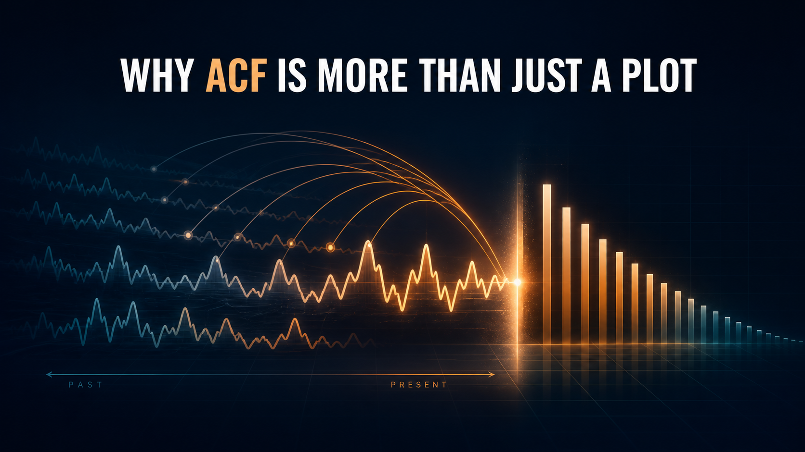

{fig-align="center" width="100%"}

# Introduction

Two observations can have the same units, come from the same source, and still require a different kind of reasoning simply because one was recorded before the other.

That is the defining feature of time series data: **order carries information**.

In an ordinary dataset, we often study the correlation between two different variables. In a time series, we can ask a different question: is the series related to an earlier version of itself? The **autocorrelation function**, or **ACF**, asks that question repeatedly—one delay at a time.

This article revolves around one central question:

> What does the ACF actually tell us about how a time series remembers its past?

The most useful first intuition is simple:

> **The ACF is a picture of memory.**

But that sentence needs a technical correction. The ACF does not detect every possible kind of memory, and it does not explain why dependence exists. It measures the **linear association between values of the same series separated by different lags**.

That distinction matters. A slowly decaying ACF may reflect genuine short-run persistence, but it can also be produced by trend or other forms of non-stationarity. If we interpret every tall bar as economic memory, the plot can become more misleading than informative.

This is the third article in a connected time series sequence. [The first article](https://mfatihtuzen.github.io/posts/2026-04-16_timeseries_stationary/) explained why stationarity matters before modeling. [The second](https://mfatihtuzen.github.io/posts/2026-05-07_timeseries_differencing/) showed that differencing changes both the statistical structure and the meaning of a series. Here, those ideas meet: we will use the ACF to see dependence—and to understand when that dependence should not be taken at face value.

# Dataset and setup

Our real-world example is the **Industrial Production: Total Index** (`INDPRO`) from [FRED](https://fred.stlouisfed.org/series/INDPRO), published by the Board of Governors of the Federal Reserve System.

The index measures real output in U.S. manufacturing, mining, and electric and gas utilities. It is monthly, seasonally adjusted, and expressed with 2017 equal to 100. The full FRED series begins in 1919. For the main analysis, we use the postwar sample beginning in January 1947. This keeps a long monthly history while avoiding some of the largest early-period changes in coverage and economic structure.

The local file `INDPRO.csv` was downloaded from:

<https://fred.stlouisfed.org/graph/fredgraph.csv?id=INDPRO>

Keeping the data beside this Quarto document makes the published analysis reproducible even if the online series is later revised.

```{r}
#| label: setup

library(readr)
library(dplyr)
library(tidyr)
library(ggplot2)
library(scales)

theme_set(
  theme_minimal(base_size = 13) +
    theme(
      plot.title.position = "plot",
      plot.caption.position = "plot",
      panel.grid.minor = element_blank(),
      legend.position = "bottom",
      strip.text = element_text(face = "bold")
    )
)

ink <- "#1f4e5f"
accent <- "#d95f02"
purple <- "#7b3294"
soft_blue <- "#8ecae6"
grey <- "#6b7280"
```

```{r}
#| label: import-data

indpro <- read_csv("INDPRO.csv", show_col_types = FALSE) |>
  transmute(
    date = as.Date(observation_date),
    production = as.numeric(INDPRO)
  ) |>
  filter(
    date >= as.Date("1947-01-01"),
    !is.na(production)
  ) |>
  arrange(date) |>
  mutate(
    log_growth = 100 * (log(production) - lag(log(production)))
  )

tidy_acf <- function(x, lag_max = 36, series = "Series") {
  x <- x[is.finite(x)]
  estimate <- stats::acf(x, lag.max = lag_max, plot = FALSE)$acf[, 1, 1]

  tibble(
    lag = 0:lag_max,
    acf = as.numeric(estimate),
    series = series,
    n = length(x),
    conf = 1.96 / sqrt(length(x))
  ) |>
    filter(lag > 0)
}

plot_acf <- function(data, title, subtitle, x_label = "Lag (months)") {
  ggplot(data, aes(lag, acf)) +
    geom_hline(yintercept = 0, color = grey, linewidth = 0.4) +
    geom_hline(
      aes(yintercept = conf),
      linetype = "dashed", color = soft_blue, linewidth = 0.7
    ) +
    geom_hline(
      aes(yintercept = -conf),
      linetype = "dashed", color = soft_blue, linewidth = 0.7
    ) +
    geom_segment(aes(xend = lag, y = 0, yend = acf), color = ink, linewidth = 0.7) +
    geom_point(color = ink, size = 1.5) +
    scale_x_continuous(breaks = scales::breaks_width(6)) +
    labs(
      title = title,
      subtitle = subtitle,
      x = x_label,
      y = "Autocorrelation"
    )
}
```

```{r}
#| label: industrial-production-level
#| fig-width: 9
#| fig-height: 5

ggplot(indpro, aes(date, production)) +
  geom_line(linewidth = 0.7, color = ink) +
  labs(
    title = "Does industrial production return to a stable level?",
    subtitle = "U.S. Industrial Production Index, monthly and seasonally adjusted, January 1947–June 2026",
    x = NULL,
    y = "Index (2017 = 100)",
    caption = "Source: Board of Governors of the Federal Reserve System via FRED (INDPRO)."
  )
```

The series moves through recessions, recoveries, long expansions, and the exceptional collapse in 2020. More importantly for our purpose, it does not fluctuate around a stable long-run mean. Nearby observations usually occupy similar parts of the long historical path.

That visual persistence is real. The question is what kind of persistence it represents.

# Why the past matters

Suppose industrial production is unusually high this month. Would that information change what you expect next month?

For many economic series, the answer is yes. Factories do not rebuild their output level from scratch every month. Production plans, demand, inventories, capacity, and business cycles evolve over time. Adjacent observations therefore tend to be related.

But “the past matters” is too vague for analysis. We need to specify **which past** and **how strongly** it is related to the present. That is where lags enter.

## What a lag means

A lag is a time separation.

For monthly data:

- lag 1 compares each month with the previous month;
- lag 2 compares each month with two months earlier;
- lag 12 compares each month with the same calendar distance one year earlier.

The unit is not always a month. Lag 1 means one observation step: one day for daily data, one quarter for quarterly data, and one year for annual data. A lag is meaningful only when interpreted in the frequency and context of the series.

To make the idea visible, let us temporarily use a controlled series and align it with a one-period-delayed copy of itself.

```{r}
#| label: lag-as-shift
#| fig-width: 9
#| fig-height: 5.5

set.seed(20260811)
lag_demo <- tibble(
  time = 1:18,
  current = as.numeric(arima.sim(model = list(ar = 0.6), n = 18))
) |>
  mutate(`Lagged by one step` = lag(current, 1)) |>
  pivot_longer(
    cols = c(current, `Lagged by one step`),
    names_to = "version",
    values_to = "value"
  ) |>
  mutate(
    version = recode(version, current = "Original series")
  )

ggplot(lag_demo, aes(time, value, color = version)) +
  geom_line(linewidth = 0.9, na.rm = TRUE) +
  geom_point(size = 2, na.rm = TRUE) +
  scale_color_manual(values = c("Original series" = ink, "Lagged by one step" = accent)) +
  scale_x_continuous(breaks = 1:18) +
  labs(
    title = "What does lag 1 do?",
    subtitle = "It shifts the series by one observation so that each value can be paired with its immediate predecessor",
    x = "Observation order",
    y = "Value",
    color = NULL
  )
```

The orange line is not a second variable collected from somewhere else. It is the same series moved one step to the right. After the shift, every valid pair contains a current value and the value immediately before it.

Increase the shift to 2, 3, or 12, and we create different pairs. The ACF summarizes the correlation in each set of pairs.

## Autocorrelation versus ordinary correlation

Ordinary correlation and autocorrelation use the same basic language of linear association, but they answer different questions.

| Question | Ordinary correlation | Autocorrelation |
|---|---|---|
| What is compared? | Two different variables, such as income and consumption | One variable and a lagged copy of itself |
| What creates the pairs? | Matching rows or observational units | Time separation |
| What does one coefficient describe? | Association between the two variables | Association at one specific lag |
| Why do we need a function? | Often one coefficient is enough for one pair of variables | We need one coefficient for every lag of interest |

The word **function** in autocorrelation function matters. An ACF is not one number. It is the sequence of correlations obtained as the lag changes.

# Building an ACF conceptually

The ACF can feel mysterious when it first appears as a finished forest of vertical bars. Its construction is much less mysterious:

1. choose a lag $k$;
2. shift the series by $k$ periods;
3. keep the overlapping current–past pairs;
4. calculate their correlation;
5. repeat for the next lag;
6. plot correlation against lag.

Allison Horst's illustrated [Time Series ACF Series](https://allisonhorst.com/time-series-acf) teaches this especially well by treating lags as distances between generations. Her sequence begins with a present-day character and a line of ancestors. It then increases the generational distance one step at a time: parent at lag 1, grandparent at lag 2, great-grandparent at lag 3, and so on. At every step, the observed similarity or difference becomes one new bar in the ACF.

That progression reveals something a finished correlogram can hide: **every bar comes from a new set of time-separated pairs**. The ACF plot is the final summary of those repeated comparisons, not the starting point.

The visual below follows that same pedagogical sequence—change the separation, rebuild the pairs, and observe the correlation—but uses an independently simulated series and original R code rather than reproducing Horst's artwork.

```{r}
#| label: lag-pair-scatterplots
#| fig-width: 9
#| fig-height: 5.5

set.seed(20260811)
pair_series <- as.numeric(arima.sim(model = list(ar = 0.6), n = 180))

lag_pairs <- bind_rows(lapply(c(1, 2, 6), function(k) {
  tibble(
    past = pair_series[1:(length(pair_series) - k)],
    current = pair_series[(k + 1):length(pair_series)],
    lag = paste0("Lag ", k, "   r = ", round(cor(past, current), 2))
  )
}))

ggplot(lag_pairs, aes(past, current)) +
  geom_point(color = ink, alpha = 0.55, size = 1.7) +
  geom_smooth(method = "lm", se = FALSE, color = accent, linewidth = 0.8) +
  facet_wrap(~ lag, nrow = 1) +
  coord_equal() +
  labs(
    title = "How does similarity change as observations move farther apart?",
    subtitle = "Each panel is an ordinary correlation computed from a different lagged pairing of the same AR(1) series",
    x = "Past value",
    y = "Current value"
  )
```

At lag 1, the point cloud has a clear positive slope: large values tend to follow large values, and small values tend to follow small values. The relationship weakens as the separation grows. Each reported correlation becomes one bar in the ACF.

Lag 0 is usually omitted from discussion because it compares every value with itself. Its autocorrelation is therefore exactly 1 and teaches us nothing new.

## The formula, after the picture

For a series $y_1,\ldots,y_T$, the sample autocorrelation at lag $k$ can be written as

$$
r_k =
\frac{
\sum_{t=k+1}^{T}(y_t-\bar{y})(y_{t-k}-\bar{y})
}{
\sum_{t=1}^{T}(y_t-\bar{y})^2
}.
$$

The numerator asks whether current and lagged values tend to sit on the same side of the overall mean. When both are above the mean—or both below it—their contribution is positive. When they fall on opposite sides, their contribution is negative. The denominator scales the result so the coefficient lies between $-1$ and $1$.

The formula is useful because it makes the technical meaning precise. The ACF measures **linear dependence at each lag**. It is not a general detector of every form of dependence, and it is not a causal explanation.

# A benchmark with no linear memory

Before interpreting structured series, we need a benchmark. **White noise** contains independent shocks with constant mean and variance. Its theoretical autocorrelation is zero at every non-zero lag.

That does not mean a sample ACF will display perfect zeros. A finite random sample produces small positive and negative correlations by chance.

```{r}
#| label: white-noise-benchmark
#| fig-width: 9
#| fig-height: 7

set.seed(20260811)
white_noise <- rnorm(400)

white_series <- tibble(
  index = 1:400,
  value = white_noise
)

white_acf <- tidy_acf(white_noise, lag_max = 30, series = "White noise")

white_series |>
  filter(index <= 160) |>
  ggplot(aes(index, value)) +
  geom_hline(yintercept = 0, color = grey, linewidth = 0.4) +
  geom_line(color = ink, linewidth = 0.6) +
  labs(
    title = "What does a process without linear memory look like?",
    subtitle = "The path is unpredictable, although short accidental runs still occur in a finite sample",
    x = "Observation order (first 160 shown)",
    y = "Value"
  )

plot_acf(
  white_acf,
  title = "The sample ACF of white noise is close to zero—not exactly zero",
  subtitle = "Small spikes are expected from sampling variation; dashed lines show approximate pointwise 95% bounds",
  x_label = "Lag (observation steps)"
)
```

The time plot still contains clusters that a human eye can mistake for a pattern. The ACF provides a disciplined comparison: no systematic decay and no repeated structure dominate the plot. A few bars may cross a confidence line by chance, especially when many lags are inspected.

# Controlled memory: AR(1) processes

White noise gives us one extreme. To isolate different degrees of persistence, consider an autoregressive process of order one:

$$
x_t = \phi x_{t-1} + \varepsilon_t,
$$

where $\varepsilon_t$ is a new white-noise shock and $\phi$ controls how much of the previous value carries into the present.

For a stationary AR(1) process with $|\phi|<1$, the theoretical ACF is

$$
\rho_k = \phi^k.
$$

This is not a rule to memorize. It tells a story. A shock is multiplied by $\phi$ after one period, by $\phi^2$ after two periods, and so on. When $\phi$ is small, its influence fades quickly. When $\phi$ is close to 1, it fades slowly.

```{r}
#| label: simulate-ar1-processes
#| fig-width: 9
#| fig-height: 7

set.seed(20260811)

phi_values <- c(0.2, 0.6, 0.9)

ar_series <- bind_rows(lapply(phi_values, function(phi) {
  tibble(
    index = 1:400,
    value = as.numeric(arima.sim(model = list(ar = phi), n = 400)),
    process = paste0("phi = ", phi)
  )
})) |>
  mutate(process = factor(process, levels = paste0("phi = ", phi_values)))

ar_series |>
  filter(index <= 160) |>
  ggplot(aes(index, value)) +
  geom_hline(yintercept = 0, color = grey, linewidth = 0.35) +
  geom_line(color = ink, linewidth = 0.55) +
  facet_wrap(~ process, ncol = 1, scales = "free_y") +
  labs(
    title = "How does persistence change as phi increases?",
    subtitle = "Larger values of phi create longer runs above or below the mean in otherwise comparable AR(1) processes",
    x = "Observation order (first 160 shown)",
    y = NULL
  )
```

At $\phi=0.2$, shocks disappear quickly and the series frequently changes direction. At $\phi=0.6$, runs become more visible. At $\phi=0.9$, the process can remain high or low for long stretches even though it is still stationary in theory.

The time plots suggest different kinds of memory. Their ACFs make the contrast explicit.

```{r}
#| label: ar1-acf-comparison
#| fig-width: 9
#| fig-height: 6

ar_acf <- ar_series |>
  group_by(process) |>
  summarise(acf_data = list(tidy_acf(value, lag_max = 24)), .groups = "drop") |>
  unnest(acf_data)

ggplot(ar_acf, aes(lag, acf)) +
  geom_hline(yintercept = 0, color = grey, linewidth = 0.4) +
  geom_hline(aes(yintercept = conf), linetype = "dashed", color = soft_blue) +
  geom_hline(aes(yintercept = -conf), linetype = "dashed", color = soft_blue) +
  geom_segment(aes(xend = lag, y = 0, yend = acf), color = ink, linewidth = 0.65) +
  geom_point(color = ink, size = 1.3) +
  geom_line(aes(y = as.numeric(sub("phi = ", "", process))^lag), color = accent, linewidth = 0.8) +
  facet_wrap(~ process, ncol = 1) +
  scale_x_continuous(breaks = scales::breaks_width(4)) +
  labs(
    title = "What does controlled memory look like in an ACF?",
    subtitle = "Sample autocorrelations (bars) follow the theoretical AR(1) decay rho[k] = phi^k (orange line)",
    x = "Lag (observation steps)",
    y = "Autocorrelation"
  )
```

The important feature is not one isolated spike. It is the **shape across lags**. Weak persistence disappears quickly; strong persistence produces a long, smooth decay. This is why an ACF should be read as a profile, not as a collection of unrelated significance tests.

# The real-data ACF: persistence everywhere

We can now return to industrial production.

```{r}
#| label: industrial-production-level-acf
#| fig-width: 9
#| fig-height: 5.5

level_acf <- tidy_acf(
  indpro$production,
  lag_max = 36,
  series = "Industrial production level"
)

plot_acf(
  level_acf,
  title = "How strongly is the industrial production level related to its past?",
  subtitle = "The ACF remains above 0.90 even at lag 36, producing an extremely slow decay",
  x_label = "Lag (months)"
)
```

The raw level has an autocorrelation of approximately `r round(level_acf$acf[level_acf$lag == 1], 3)` at lag 1 and `r round(level_acf$acf[level_acf$lag == 36], 3)` at lag 36. If the ACF were interpreted mechanically, we might conclude that industrial production has an extraordinarily long economic memory.

That conclusion would be too quick.

# The persistence versus non-stationarity trap

Recall what the level plot showed: industrial production in later decades generally occupies a different range from production in the early postwar years. When a series trends, observations that are close in time also tend to be close in level. The ACF records that similarity, even if it is driven by movement in the mean rather than a stable dependence mechanism.

This is the central trap:

> A slow ACF decay in a non-stationary series is evidence of persistence in the observed levels, but it is not automatically evidence of a stable, long-lived economic memory.

The distinction is subtle but practical. The sample ACF averages relationships across the whole period as though one mean and one dependence structure were meaningful. A strongly trending series violates that interpretation. Its high correlations partly compare “early with early” and “late with late.” Time location itself is doing much of the work.

This is why the earlier article on [stationarity](https://mfatihtuzen.github.io/posts/2026-04-16_timeseries_stationary/) comes before ACF interpretation in this series. ACF is most interpretable as a stable memory profile when the underlying process is at least approximately stationary.

# What changes after transformation?

To shift the question from the **level of production** to its **month-to-month proportional change**, we calculate

$$
g_t = 100\left[\log(x_t)-\log(x_{t-1})\right].
$$

For small changes, $g_t$ is approximately the monthly percentage growth rate. This transformation does more than make the plot look stable. It changes the object being studied—from how high production is to how quickly it is changing.

```{r}
#| label: industrial-production-growth
#| fig-width: 9
#| fig-height: 5

ggplot(indpro, aes(date, log_growth)) +
  geom_hline(yintercept = 0, color = grey, linewidth = 0.4) +
  geom_line(linewidth = 0.6, color = accent, na.rm = TRUE) +
  coord_cartesian(ylim = c(-15, 10)) +
  labs(
    title = "Does monthly industrial production growth behave more stably?",
    subtitle = "Log growth removes the changing level, but recessions and the exceptional 2020 shock remain visible",
    x = NULL,
    y = "Monthly log growth (%)",
    caption = "The vertical scale is limited to preserve readability; the April 2020 value falls below the displayed range."
  )
```

The transformed series fluctuates around a much more stable center. It still contains economic structure: the first months of recessions tend to cluster, and volatility changes during major disruptions. Transformation has not turned the data into white noise, nor should that be the goal.

Now compare the ACFs on the two scales.

```{r}
#| label: level-growth-acf-comparison
#| fig-width: 9
#| fig-height: 6.5

growth_acf <- tidy_acf(
  indpro$log_growth,
  lag_max = 36,
  series = "Monthly log growth"
)

acf_comparison <- bind_rows(
  level_acf |>
    mutate(series = "Production level"),
  growth_acf |>
    mutate(series = "Monthly log growth")
) |>
  mutate(series = factor(series, levels = c("Production level", "Monthly log growth")))

ggplot(acf_comparison, aes(lag, acf)) +
  geom_hline(yintercept = 0, color = grey, linewidth = 0.4) +
  geom_hline(aes(yintercept = conf), linetype = "dashed", color = soft_blue) +
  geom_hline(aes(yintercept = -conf), linetype = "dashed", color = soft_blue) +
  geom_segment(aes(xend = lag, y = 0, yend = acf), color = ink, linewidth = 0.65) +
  geom_point(color = ink, size = 1.3) +
  facet_wrap(~ series, ncol = 1, scales = "free_y") +
  scale_x_continuous(breaks = scales::breaks_width(6)) +
  labs(
    title = "What part of the apparent memory survives transformation?",
    subtitle = "The slow decay in levels largely disappears when the question changes to monthly proportional growth",
    x = "Lag (months)",
    y = "Autocorrelation"
  )
```

The contrast is the article's main empirical result. The raw level ACF remains close to 1 across three years of lags. The growth ACF drops from about `r round(growth_acf$acf[growth_acf$lag == 1], 2)` at lag 1 to about `r round(growth_acf$acf[growth_acf$lag == 2], 2)` at lag 2, then stays much closer to zero.

Some short-run dependence remains. That is economically plausible and potentially modelable. But most of the dramatic “memory” in the level ACF was tied to the non-stationary level, not to a stationary mechanism transmitting nearly the same influence for years.

The negative correlations around annual and two-year lags should also be interpreted cautiously. They may reflect business-cycle dynamics, historical episodes, changing volatility, data construction, or sampling variation. An ACF identifies a pattern to investigate; it does not name its cause.

This returns us to the key lesson from [the differencing article](https://mfatihtuzen.github.io/posts/2026-05-07_timeseries_differencing/): a transformation does not merely clean the same variable. It changes the question.

# How to read an ACF

An ACF becomes more useful when read in a consistent order.

## Start with the sign

- **Positive autocorrelation** means high values tend to follow high values, and low values tend to follow low values, at that lag.
- **Negative autocorrelation** means high values tend to be paired with low values, and vice versa. This can indicate alternation or oscillation.
- **Near-zero autocorrelation** means little linear association at that lag. It does not prove independence.

## Then consider magnitude

An autocorrelation near 1 or $-1$ indicates a strong linear relationship. A value near zero indicates a weak linear relationship. Magnitude should be judged together with sample size, context, and the rest of the ACF—not by a universal cutoff.

## Read the decay, not only the spikes

- a fast decay suggests short memory;
- a slow, smooth decay can indicate strong persistence, but may also signal trend or non-stationarity;
- an alternating decay suggests oscillatory behavior;
- repeated peaks at seasonal lags suggest a seasonal pattern.

For monthly data, peaks at 12, 24, and 36 have a different interpretation from peaks at 1, 2, and 3. The horizontal axis is elapsed time, not merely a sequence of bar numbers.

## Read the plot beside the series

Never interpret the ACF without first looking at the time plot. Trend, seasonality, structural breaks, outliers, and changing variance can all shape autocorrelations. The ACF compresses the series; compression is useful, but it hides time location.

# What do the confidence bands mean?

The dashed lines in the plots are approximately

$$
\pm \frac{1.96}{\sqrt{T}},
$$

where $T$ is the number of observations. Under a white-noise benchmark, a sample autocorrelation outside these pointwise bounds would be unusual for one prespecified lag.

Three cautions are essential.

First, the lines are **reference bands, not proof of a model**. A bar inside the band does not establish independence, and a bar outside it does not explain the dependence.

Second, they are pointwise. If we inspect many lags, the chance that at least one bar crosses a 95% line is greater than 5%. One isolated crossing can easily be sampling variation.

Third, the simple bands are derived for a white-noise comparison. They should not be used as a mechanical significance filter for a visibly non-stationary series such as the industrial production level.

The pattern across lags and the behavior of the original series matter more than a binary inside/outside classification.

# Common mistakes

Most ACF mistakes are interpretive rather than computational.

**Mistake 1: treating one spike as a complete structure**

One large coefficient can be interesting, but dependence is usually understood from the profile across neighboring and contextually meaningful lags.

**Mistake 2: reading slow decay as pure economic memory**

Trend and other forms of non-stationarity can create large positive autocorrelations over many lags. Inspect and stabilize the series before giving the decay a stationary interpretation.

**Mistake 3: assuming zero autocorrelation means randomness**

The ACF measures linear dependence. A process can have zero autocorrelation while retaining nonlinear dependence, changing variance, or other non-random structure.

**Mistake 4: equating correlation with causation**

Autocorrelation says that values separated by a lag move together linearly. It does not show that the earlier observation causes the later one. Both may respond to shared dynamics, trends, seasonality, policy, or measurement procedures.

**Mistake 5: ignoring the meaning of a lag**

Lag 12 is one year for monthly data but 12 days for daily data. The same numerical lag can represent a completely different mechanism at a different frequency.

**Mistake 6: using confidence bands as a model-selection vending machine**

Counting significant bars is not a substitute for understanding the series, checking stationarity, comparing plausible models, and diagnosing residuals.

# A practical workflow

When using an ACF in real analysis, follow this sequence:

1. **Define the series and its frequency.** Know what one lag means in calendar and substantive terms.
2. **Plot the series first.** Look for trend, seasonality, breaks, outliers, and changing variance.
3. **Clarify the analytical question.** Are you studying levels, absolute changes, proportional growth, or residuals?
4. **Assess whether a stationary interpretation is plausible.** Transform or difference only when the transformation matches the question.
5. **Inspect the ACF as a shape.** Read sign, magnitude, decay, oscillation, and seasonal repetition together.
6. **Use confidence bands cautiously.** Treat them as a white-noise reference, not a final decision rule.
7. **Investigate plausible mechanisms.** Ask what economic or operational process could create the observed lags.
8. **Revisit the time plot.** Confirm that the compressed ACF story is consistent with what happened over time.
9. **Use the ACF as one input to modeling.** Model comparison and residual diagnostics must still follow.

This workflow prevents two opposite errors: ignoring genuine dependence and inventing a memory story from non-stationary levels.

# Final thoughts

The ACF is more than a plot because it changes a vague statement—“the past matters”—into a profile of linear dependence across time separations.

White noise showed what no systematic linear memory looks like. AR(1) simulations isolated how persistence changes the rate of decay. Industrial production then demonstrated the harder real-world lesson: a striking ACF can be statistically correct and still invite the wrong interpretation.

The raw production level remembers its historical position so strongly that correlations remain near 1 for years. After moving to monthly log growth, most of that slow decay disappears and a shorter dependence pattern remains. The transformation reveals that the original ACF mixed at least two ideas: short-run dynamics and a changing long-run level.

So the memorable idea needs its full version:

> **The ACF is a picture of linear memory—but first make sure the series is capable of remembering in a stable way.**

The next article will turn to the **partial autocorrelation function (PACF)**. The purpose will not be to memorize AR and MA identification rules, but to ask a more precise question: what does a lag add after the shorter lags have already had their say?

# References and further reading

**Data and methodology**

- Board of Governors of the Federal Reserve System. [Industrial Production: Total Index (INDPRO)](https://fred.stlouisfed.org/series/INDPRO). FRED, Federal Reserve Bank of St. Louis.
- Board of Governors of the Federal Reserve System. [Industrial Production and Capacity Utilization: Explanatory Notes](https://www.federalreserve.gov/releases/g17/IpNotes.htm).

**Autocorrelation and time series foundations**

- Hyndman, R. J., and Athanasopoulos, G. [*Forecasting: Principles and Practice*, 3rd edition—Autocorrelation](https://otexts.com/fpp3/acf.html). OTexts.
- NIST/SEMATECH. [e-Handbook of Statistical Methods: Autocorrelation Plot](https://www.itl.nist.gov/div898/handbook/eda/section3/autocopl.htm).
- R Core Team. [`acf`: Auto- and Cross-Covariance and Correlation Function Estimation](https://stat.ethz.ch/R-manual/R-devel/library/stats/html/acf.html). R documentation.

**Visual intuition**

- Horst, A. [Time Series ACF Series](https://allisonhorst.com/time-series-acf). Artwork by Allison Horst. The illustrated sequence uses generations to show how lag-specific comparisons become the bars of an ACF. The analytical figures in this article are independent recreations made in R and do not reproduce the artwork.

**Earlier articles in this series**

- Tüzen, M. F. [Why Most Time Series Models Fail Before They Start](https://mfatihtuzen.github.io/posts/2026-04-16_timeseries_stationary/).
- Tüzen, M. F. [Differencing: A Transformation or a Trap?](https://mfatihtuzen.github.io/posts/2026-05-07_timeseries_differencing/).

------------------------------------------------------------------------

```{=html}
<!--
SEO Title: Why ACF Is More Than Just a Plot: A Practical Guide to Time Series Memory
SEO Description: Learn what the autocorrelation function really measures, how to read lags and decay, and why non-stationary data can create misleading persistence.
Medium Topics: Time Series Analysis, Data Science, R Programming, Statistics, Forecasting
Hero image: timeseries_acf.png
-->
```
